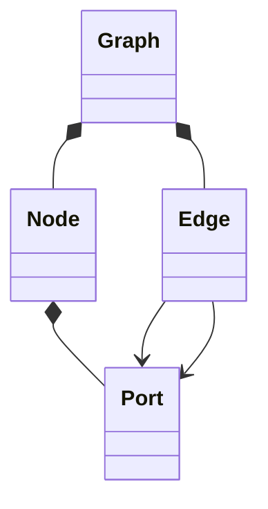
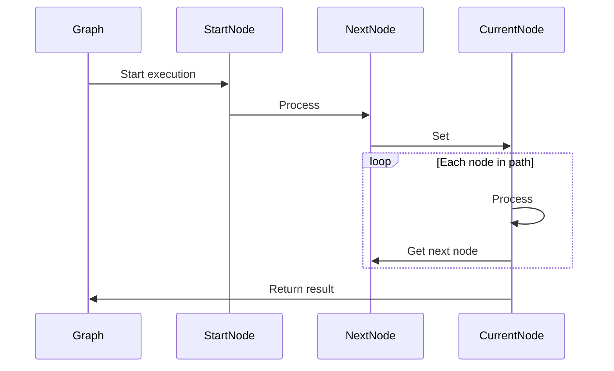

+++
title = "Core Concept"
description = "N2 Core Concept"
weight = 30
date = "2025-12-12T01:46:39.298Z"
+++

At the core of N2 is a simple but powerful concept: **every node is a process**. Each process can accept inputs and produce outputs, and when connected, nodes form a chain—or graph—of automation tasks.

_N2 Core Concept_
{.text-center}

In N2, a **graph** is the central entity that represents a complete automation workflow. It is composed of **nodes** (representing actions, conditions, data handling, etc.) and **edges** (representing the relationships and data flow between nodes).

## Nodes and Edges
### Nodes
A **node** represents a single step or action in a workflow. Each node is defined by the following attributes:

- **Type**: The type of the node.
- **Configuration**: Node-specific settings that determine its behavior.
- **Ports**: Interfaces through which a node interacts with other nodes:
  - **Input ports**: Receive data or control signals.
  - **Output ports**: Send data or control signals.
  - **Auxiliary input ports**: Optional inputs to support additional functionality.
  - **Auxiliary output ports**: Optional outputs to provide extended functionality.

> [!INFO]
> Auxiliary ports are optional and may not exist on all nodes. They are designed specifically to support the node’s specialized behaviors.

### Edges
Edges define the **connections between nodes** and dictate the flow of data or control. Each edge connects an **output port** of one node to an **input port** of another node, establishing both logical and functional relationships in the workflow.

## Graph Execution

Graphs in N2 are executed by **traversing nodes and edges**, processing each node according to its type and configuration. Execution typically begins at a start node and proceeds along defined paths until all nodes have been processed or a termination condition is met.

_Standard Node Sequencing_
{.text-center}
