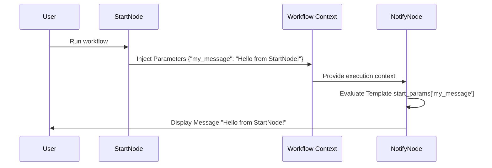

+++
title = "Simple Workflow"
weight= 20
description = "Learn how to create a simple workflow to understand the basics of N2 graphs and workflows."
images = ["images/logo-gray.png"]
date = "2025-12-12T01:46:39.298Z"
+++

## Prerequisites
- The N2 Core modules and the N2 Messaging module must be installed.

If you have not installed the N2 modules yet, please refer to the [Quick Start](/n2-doc/20-getting-started) guide.

## Displaying Static Message with `NotifyNode`
In this section, you will create a simple workflow that displays a static message using a `NotifyNode`. This exercise introduces the basic concepts of building workflows in N2.

1. Create a New Graph
   1. From the Odoo main menu, click **N2**.
   

   2. In the list view, click the **Designer** button in the top-left corner.
   

2. Add a `StartNode`
   1. In the left sidebar, locate the `StartNode`.
   2. You can scroll through the node list or use the search box to find it quickly.
   
3. Add a `NotifyNode` and Connect the Nodes
   1. Add a `NotifyNode` to the canvas.
   2. Connect the `StartNode` to the `NotifyNode`:
      - Click and hold the left mouse button on the output port (right side) of the `StartNode`.
      - Drag the connection to the input port (left side) of the `NotifyNode`.

   
4. Configure the `NotifyNode`
   1. On the `NotifyNode`, click the dialog button for the **Template** input field.
   2. In the input dialog, paste the following text:
      ```
      Hello World!
      ```
   3. Click **Apply** to save the value.
      

5. Save, Process, and Run the Graph
   1. Click the `{} Save` button on the toolbar and provide a name for the graph.
   2. Process the graph by clicking the `{} Process` button on the toolbar.
   3. Run the workflow by clicking the `{} Run` button on the toolbar.
      

## Displaying Dynamic Message
You can either reuse the existing graph or create a new one by following the same steps above.

1. Configure the `StartNode` Parameters
   1. Open the input dialog for the **Parameters** field of the `StartNode`.
   2. Paste the following content:
      ```python
      {
         "my_message": "Hello from StartNode!"
      }
      ```
2. Update the `NotifyNode` Template
   1. Open the input dialog for the **Template** field of the NotifyNode.
   2. Paste the following template expression:
      ```python
      {{  start_params["my_message"]  }}
      ```
3. Save, process and run the graph.
   

## Explanation

### Workflows and Graphs in N2
In N2, a *workflow* is represented as a *graph*. A graph is composed of nodes connected by directional links (edges) that define the execution flow. When a graph is run, execution starts from the `StartNode` and continues through each connected node in the order defined by the graph.

### Nodes as Execution Units
Each node represents a single unit of work within the workflow, such as starting execution, sending a notification, or processing data. Nodes encapsulate logic and expose parameters that allow you to configure their behavior without writing code.

### Node Parameters and Types
Every node defines one or more parameters, and each parameter has a specific data type (for example, string, number, dictionary, or template). These types determine how values are entered, validated, and interpreted during workflow execution. Providing values that match the expected type is essential for successful execution.

### The Role of the `StartNode`
The `StartNode` is the entry point of every workflow. It initializes the workflow execution context. The **Parameters** field of the `StartNode` accepts a dictionary of values, which are injected into the workflow context as `start_params`.

> [!NOTE]
> This example shows one way data can be provided to nodes. In general, nodes can also communicate through their outputs and connections (edges). How data flows between nodes depends on the node's design.

### Workflow Execution Context
During execution, N2 maintains a shared *context dictionary* that stores data accessible to all nodes. Nodes that support templating or dynamic expressions can read from this context. The `start_params` object is part of this context and demonstrates how initial parameters flow through the workflow.

### Node Communication via Connections
In addition to the execution context, nodes communicate via the **edges** (connections) in the graph. The output produced by a node can be passed as input to the next connected node. This mechanism allows workflows to pass data dynamically from one node to another, enabling more complex and data-driven processes.

### The `NotifyNode` and Message Rendering
The `NotifyNode` displays a message to the current user. Its **Template** parameter supports:
- **Static content** (e.g., `Hello World!`)
- **Dynamic content** (evaluated from the workflow context, e.g., `{{ start_params["my_message"] }}`)

This shows how a downstream node can render dynamic messages based on data provided by upstream nodes, either from the context or from the previous node’s outputs.

### Templating and Dynamic Messages
   Template expressions allow values from the execution context or upstream nodes to be inserted into the node’s behavior dynamically. This makes workflows reusable and flexible because node behavior can change depending on the data provided during execution.

### Processing vs. Running a Graph
 - **Processing** a graph validates the structure, parameters, and connections, preparing it for execution.
 - **Running** a graph executes the workflow using the processed definition.

Separating these steps ensures predictable behavior and helps catch configuration errors before runtime.

### Next Steps
While this tutorial demonstrates a minimal workflow, the same principles apply to more complex graphs. By combining multiple nodes and passing data through both **parameters** and **connections**, you can build sophisticated, data-driven workflows. Always refer to individual node documentation for details on available parameters, outputs, and supported template variables.
