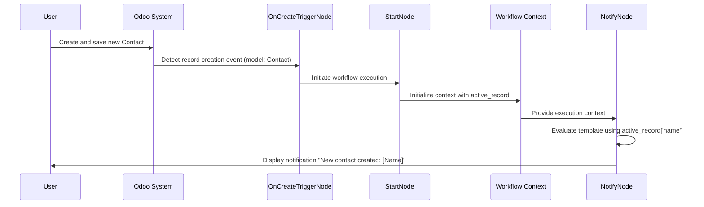

+++
title = "Workflow's Trigger"
weight= 30
description = "Learn how to create automated workflows with trigger nodes that respond to events."
images = ["images/logo-gray.png"]
date = "2025-12-12T01:46:39.298Z"
+++

## Prerequisites
- The N2 Core modules, N2 Trigger module and the N2 Messaging module must be installed.

    If you have not installed the N2 modules yet, please refer to the [Quick Start](/n2-doc/20-getting-started) guide.

- Complete the [Simple Workflow](../20-simple) tutorial.

    Please refer to the [Simple Workflow](../20-simple) tutorial on how to create a simple workflow, this tutorial uses the steps explained there.

- Contact module is installed.

## Responding to Record Creation with `OnCreateTriggerNode`
In this section, you will create a simple workflow which is triggered when a new **Contact** is created. Similar with the [Simple Workflow](../20-simple) tutorial, we'll also display a message to user with `NotifyNode` as visual cue to indicate the workflow is working.

1. Create a new graph.
2. Add `StartNode` and `NotifyNode` and connect these nodes.
3. Add `OnCreateTriggerNode` and connect it to the `StartNode`.
4. Configure the nodes
   1. Set the **Model** parameter of the `OnCreateTriggerNode` to **Contact**.
   2. Leave the `StartNode` parameter empty.
   3. Paste the following to `NotifyNode`s **Template** input dialog:
      ```python
      {{  active_record["name"] if is_defined("active_record") else "No active record available." }}
      ```
5. Save and process the graph. Do not run the graph.
   
6. Create a new **Contact**, a notification containing the new contact's name should be displayed when you save the new contact.
   

## Explanation



### Trigger Nodes
Trigger nodes allow workflows to run automatically in response to specific events, making N2 a powerful tool for visual automation.

### N2 Trigger Module
The N2 Trigger module provides various trigger nodes. This tutorial focuses on record-bound triggers, such as OnCreateTriggerNode.

There are generally two types of triggers:
- Record-bound triggers: Activated by operations on Odoo records (e.g., creation, update, or deletion). These provide additional information to the workflow context about the record that triggered the event.
- Non-record-bound triggers: Activated by other events (e.g., scheduled cron jobs or webhooks). These do not provide an active_record.

### Differences from Manual Workflows
Unlike the manual workflows in the Simple Workflow tutorial (started via the StartNode), trigger-based workflows supplement the StartNode with a trigger node as the entry point. The trigger detects events and automatically starts execution, passing relevant data (like `active_record`) into the context for downstream nodes.

### Port Spec
In N2, a port may have a **spec**, which defines a constraint on port connectivity, allowing it to connect only to other ports with the same **spec**. Visually, a port’s shape represents its **spec**, indicating that only ports with matching shapes can be connected.

In the case of trigger nodes, they expose an output port with a dedicated **spec**, which can connect only to the input port of the `StartNode`.


### Next Steps
This example demonstrates a basic event-driven workflow. By combining different trigger nodes with additional action nodes, you can automate complex processes like sending emails, updating records, or integrating with external systems. Refer to the documentation for specific trigger nodes to explore available events and context variables.