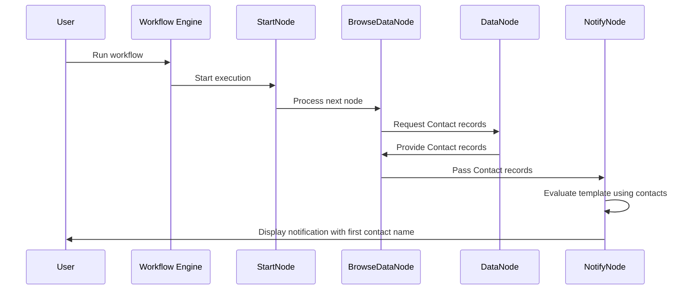

+++
title = "Data Nodes"
weight= 40
description = "Learn how to use data nodes to perform data operations within your workflows."
images = ["images/logo-gray.png"]
date = "2025-12-12T01:46:39.298Z"
+++

## Prerequisites
- The N2 Core modules, N2 Data module and the N2 Messaging module must be installed.

  If you have not installed the N2 modules yet, please refer to the [Quick Start](/n2-doc/20-getting-started) guide.

- Complete the [Simple Workflow](../20-simple) tutorial.

  Please refer to the [Simple Workflow](../20-simple) tutorial to understand the basics for creating N2 workflow.

- Contact module is installed.

## Retrieving Data
In this section, you will create a simple workflow to retrieve **Contact** records from the database. Similar with the [Simple Workflow](../20-simple) tutorial, we will display a message to the user using `NotifyNode` as a visual cue to indicate that the workflow is working correctly.

This workflow demonstrates how data nodes can be used to query records, extract specific fields, and pass the results to the downstream nodes.

1. Create a new graph.
2. Add `StartNode`, `NotifyNode`, `BrowseDataNode`, `DataNode` and connect this nodes.
3. Configure the `BrowseDataNode` to have **Contact** as it's model.
4. Configure the `DataNode`:
   1. Set the **Key** to `contacts`.
   2. Add `Name` to the **Fields** input.
5. Paste the following into the `NotifyNode` Template input dialog:
   ```python
   First contact in database: {{ [cnt["name"] for cnt in contacts][0] }}
   ```
6. Save, process and run the graph. A notification should be displayed showing the name of the first contact in your database.
   

## Explanation


### Data Nodes
Data nodes allow workflows to retrieve and transform Odoo data and pass the results to downstream nodes as parameters.
These parameters can then be accessed directly by subsequent nodes, such as `NotifyNode`, for rendering templates or performing actions.

### Requesting Data with `BrowseDataNode`
The `BrowseDataNode` retrieves records for a specified model and passes the resulting recordset to the next node.
It serves as the entry point for data retrieval but does not modify the data itself.

### Retrieving Data with `DataNode`
The DataNode extracts specific fields from incoming records and exposes the result as a named parameter, defined by the **Key**.

In this example:
* The extracted contact data is exposed under the parameter name contacts
* Only the name field is included
* Downstream nodes can access contacts directly in their configuration or templates

## Next Steps
This example demonstrates basic data retrieval and parameter passing within a workflow. By combining data nodes with trigger nodes and action nodes, you can build more advanced automations such as:
* Conditional logic based on queried data
* Updating or creating records
* Sending notifications or messages based on database state

Refer to the documentation for additional data nodes and configuration options to explore more advanced data operations.