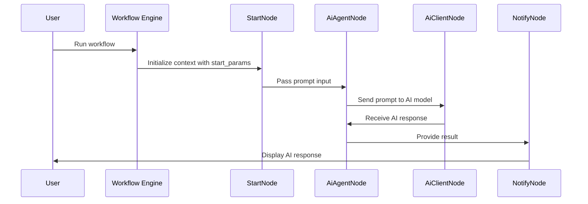

+++
title = "AI Integration"
weight= 50
description = "Learn how to integrate AI into your workflow and use it to automate tasks and enhance productivity."
images = ["images/logo-gray.png"]
date = "2025-12-12T01:46:39.298Z"
+++

## Prerequisites
- The N2 Core modules, N2 AI module and the N2 Messaging module must be installed.

  If you have not installed the N2 modules yet, please refer to the [Quick Start](/n2-doc/20-getting-started) guide.

- Complete the [Simple Workflow](../20-simple) tutorial.

  Please refer to the [Simple Workflow](../20-simple) tutorial to understand the basics for creating N2 workflow.

- This tutorial uses [LM Studio](https://lmstudio.ai/) for the AI backend

  If you're using other AI backend, please adjust accordingly.

## Preparation
AI models must be registered before using N2 AI module:
1. Select N2 on Odoo main menu
2. Select **AI Models** from the configuration menu
3. Add new record by clicking **New** button.
4. Enter the **exact** model name as listed on **LM Studio** on the **Model Name** field.
5. Enter description or you can just copy the model name to the **Description** field.
  

## Creating AI Workflow
In this section, you will create a simple workflow with AI nodes to generate a simple text. Similar with the [Simple Workflow](../20-simple) tutorial, we will display a message to the user using `NotifyNode` as a visual cue to indicate that the workflow is working correctly.

1. Create a new graph.
2. Add `StartNode`, `AiAgentNode`, `AiClientNode`, `NotifyNode` and connect this nodes.
3. Paste the following to the `Parameters` input dialog of the `StartNode`:
   ```python
    {
        "my_message": "Hello!"
    }
   ```
4. Paste the following to the `Prompt` input dialog of the `AiAgentNode`:
   ```python
   {{  start_params["my_message"] }}
   ```
5. Configure the `AiClientNode` by selecting AI model registered earlier.
6. Paste the following to the `Template` input dialog of the `NotifyNode`:
   ```python
   {{ result }}
   ```
7. Save, process and run the graph. A notification showing the AI response should be displayed.
  

## Explanation


This tutorial demonstrates how AI nodes can be used to generate text and pass the result to downstream nodes within a workflow.

### Generating Prompts with `AiAgentNode`
The `AiAgentNode` prepares the prompt that will be sent to the AI backend.
It evaluates a template using values from the workflow context and produces a prompt string.

In this example the prompt is built using the `my_message` parameter provided by the `StartNode`.

### Sending Requests with `AiClientNode`
The `AiClientNode` sends the prepared prompt to the configured AI model. It acts as the execution layer for AI requests and returns the model’s response.

The response from the AI backend is exposed as the `result` parameter

### Displaying Results with `NotifyNode`
In this tutorial, the `NotifyNode` renders the AI-generated output using the `result` parameter produced by the `AiClientNode` and displays it as a notification.

## Next Steps
This example demonstrates basic AI integration and parameter passing within a workflow.
By combining AI nodes with trigger nodes and data nodes, you can build more advanced automations such as:
* Generating AI responses based on database records
* Automating actions using AI-generated content
* Sending contextual notifications powered by AI output
* Use advanced AI features such as tools, MCPs, and context providers into your workflow

Refer to the documentation for additional AI nodes and configuration options to explore more advanced AI-driven workflows.
