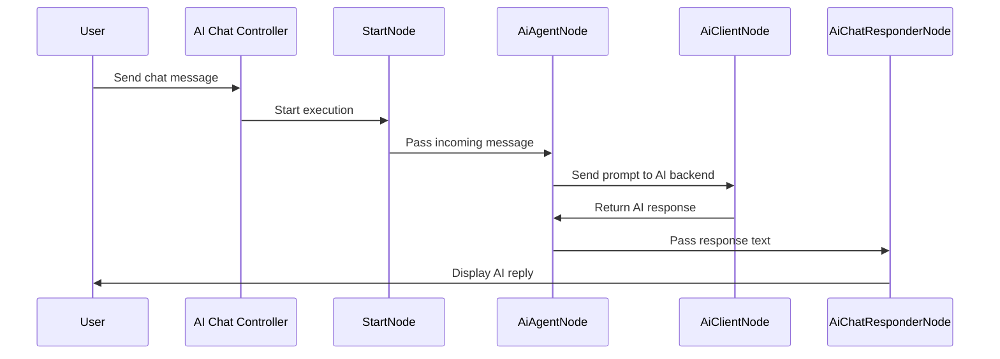

+++
title = "AI Chat"
weight= 60
description = "Learn how to use the N2 workflow to set up and run your first AI chat pipeline step by step."
images = ["images/logo-gray.png"]
date = "2025-12-12T01:46:39.298Z"
+++

## Prerequisites
- The N2 Core modules, N2 AI module, N2 AI Chat module and AI Chat Base module must be installed.

  If you have not installed the N2 modules yet, please refer to the [Quick Start](/n2-doc/20-getting-started) guide.

- Complete the [Simple Workflow](../20-simple) tutorial.

  Please refer to the [Simple Workflow](../20-simple) tutorial on how to create a simple workflow, this tutorial uses the steps explained there.

- This tutorial uses [LM Studio](https://lmstudio.ai/) for the AI backend

  If you're using other AI backend, please adjust accordingly.

## Preparation
N2 AI Chat module is an extension of the N2 AI module, as such, the requirements are similar: AI models must be registered before using N2 AI Chat module. Please see the [AI tutorial](../50-ai) for more information.

## Creating AI Chat Workflow
In this section, you will create a basic AI Chat pipeline with AI nodes.
1. Create a new graph.
2. Add `OnAiChatMessageNode`, `StartNode`, `AiAgentNode`, `AiClientNode`, `AiChatResponderNode` and connect this nodes.
3. Paste the following to the `Prompt` input dialog of the `AiAgentNode`:
   ```python
   {{ message["text"] }}
   ```
4. Set `AiAgentNode`s `Streaming` and `Stateful` parameter on.
5. Configure the `AiClientNode` by selecting the available AI model.
6. Save and process the graph.
  
7. Click the **Test Chat** button on the `OnAiChatMessageNode`.
8. You can now chat with your AI.
  

## Explanation


This tutorial demonstrates how N2 can be used to enable AI chat in Odoo, allowing workflows to process user messages, generate AI responses, and send them back to the chat interface.

## Responding to User Messages
Internally the `OnAiChatMessageNode` only mark the workflow as an AI chat pipeline and provide interface to test the pipeline by showing the chat dialog. N2 AI Chat module implement the communication between backend and frontend using standard Odoo controller to retrieve user messages and bus module to send AI responses.

## Extending N2 AI Module
The N2 AI Chat module illustrates how existing nodes can be extended. In this case, the `AiAgentNode` is enhanced with support for streaming responses and maintaining conversation state.

> [!WARNING]
> Enabling process monitoring will slow response streaming. To avoid this, you can disable process monitoring or turn off streaming chat.

## Next Steps

This example demonstrates how to enable AI Chat in Odoo, but there are many ways to extend and enhance your workflows using N2 and the AI nodes:

- **Build multi-agent AI pipelines:** N2 allows you to connect multiple AI agents in a single workflow, enabling complex interactions and collaborative responses.
- **Leverage advanced AI features:** The N2 AI module supports tools, MCP (Model Context Protocol), and context providers, all of which can be integrated into your chat workflow to enrich responses and maintain more sophisticated conversation context.
- **Experiment with different AI models:** Trying different models can help you compare performance, response style, and relevance, allowing you to choose the best fit for your use case.
- **Extend the workflow:** You can combine AI chat with other workflow nodes, such as logging messages, triggering notifications, or automating follow-up actions, to create fully integrated business processes.

By exploring these options, you can move beyond a simple chat interface and build powerful, context-aware AI interactions within Odoo.
